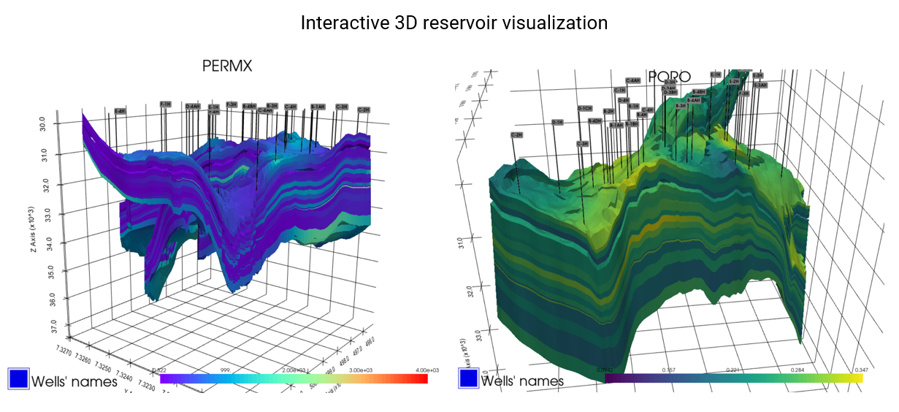
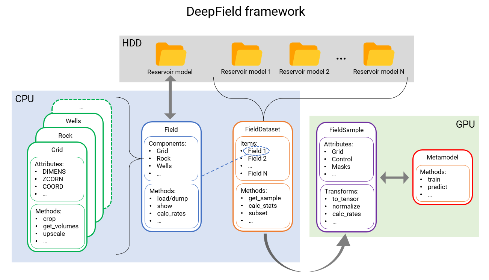

[](https://python.org)
[](https://pytorch.org)


# DeepField

Machine learning framework for reservoir simulation.



## Features

* reservoir representation with Grid, Rock, States, Wells, Aquifer and PVT-tables components
* interactive 3D visualization with some advanced options
* common reservoir preprocessing tools
* working with arbitrary large datasets of field simulations
* constructor of neural network models
* generative models for field augmentation
* various model training scenarious for arbitrary long simulation periods
* detailed [documentation](https://Skoltech-CHR.github.io/DeepField) and step-by-step [tutorials](/tutorials)
* complete [pipelines](/pipelines) of the reservoir simulation steps




## Installation

Clone the repository:

    git clone https://github.com/Skoltech-CHR/DeepField.git

Working with a remote server, it is recommended to install
VNC for remote rendering of 3D graphics (follow this [instruction](./vnc/README.md))


## Quick start

Load a reservoir model from `.DATA` file:

```python

  from deepfield import Field

  model = Field('model.data').load()
```

See the [tutorials](./tutorials) to explore the framework step-by-step
and the [documentation](https://Skoltech-CHR.github.io/DeepField) for more details.


## Model formats

Initial reservoir model can be given in a mixture of ECLIPSE, MORE, PETREL, tNavigator formats.
However, there is no guarantee that any mixture will be understood.
Main file should be in .DATA file. Dependencies can be text and binary files including common formats:

* .GRDECL
* .INC
* .RSM
* .UNRST
* .RSSPEC
* .UNSMRY
* .SMSPEC
* .EGRID
* .INIT

Within the `DeepField` framework it is recommended to use the HDF5 format
to speed up data load and dump in Python-friendly data formats. In this
case all data are contained in a single .HDF5 file. At any point the model
can be exported back into .DATA text and binary files to ensure a compatibility
with conventional software.

## Citing

Plain
```
Illarionov, E., et al. "End-to-end neural network approach to 3D reservoir simulation and adaptation." arXiv preprint arXiv:2102.10304 (2021).
```

BibTex
```
@ARTICLE{2021arXiv210210304I,
       author = {{Illarionov}, E. and {Temirchev}, P. and {Voloskov}, D. and {Kostoev}, R. and {Simonov}, M. and {Pissarenko}, D. and {Orlov}, D. and {Koroteev}, D.},
        title = "{End-to-end neural network approach to 3D reservoir simulation and adaptation}",
      journal = {arXiv e-prints},
     keywords = {Computer Science - Machine Learning, Physics - Geophysics},
         year = 2021,
        month = feb,
          eid = {arXiv:2102.10304},
        pages = {arXiv:2102.10304},
archivePrefix = {arXiv},
       eprint = {2102.10304},
 primaryClass = {cs.LG}
}
```
